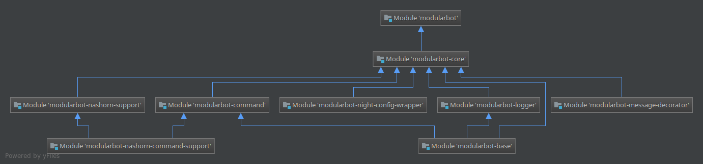

# ModularBot 2
[](https://search.maven.org/#search%7Cga%7C1%7Cg%3A%22com.jesus-crie%22)

> This project is at its early stage of development, so any bug reports are
welcome.

> There are probably typos and some language mistakes in this project, if you
see one, notify me.

ModularBot is a kind of little framework for making discord bots with [JDA](https://github.com/DV8FromTheWorld/JDA).

It comes in little modules that can be added to the core and allow you to
customize your installation by not having to compile useless things that you
won't use.

It's a v2 because there's been a long pause since v1 and JDA has changed a lot. 

1. [Getting Started](#getting-started)
2. [Modules](#modules)
    1. [Available Modules](#available-modules)
        1. [Base](#base)
        2. [Core](#core*)
        3. [Console Logger](#console-logger*)
        4. [Command](#command*)
        5. [Night Config Wrapper](#night-config-wrapper)
        6. [JS Nashorn Support](#js-nashorn-support)
        7. [JS Nashorn Command Support](#js-nashorn-command-support)
        8. [Message Decorator](#message-decorator)
        9. [Audio](#audio)
        10. [Eval](#eval)
    2. [Your Custom Module](#your-custom-module)

## Getting Started

You can download each modules with gradle from maven central.
```groovy
repositories {
    mavenCentral()
    jcenter()
}

dependencies {
    implementation 'com.jesus-crie:modularbot-base:2.3.4_18'
}
```
And now you can register commands and start your bot with:
```java
// Build a new instance of ModularBot with the base modules.
ModularBot bot = new ModularBotBuilder("token")
        .autoLoadBaseModules()
        .build();

// Register a quick command.
CommandModule module = bot.getModuleManager().getModule(CommandModule.class);
module.registerCreatorQuickCommand("stop", e -> bot.shutdown());

bot.login();
```
That's all the code required to make ModularBot work with commands.

## Modules

For simplicity, all of the modules (made by me) uses the same version
name, so if version 2.1.0 is released for a module, **ALL** other modules
will be updated to this version. So you can use a global variable do define
the version of ModularBot that you want to use.

All of the modules made by me are in this github repository and available
on [Maven Central](https://search.maven.org/#search%7Cga%7C1%7Cg%3A%22com.jesus-crie%22).

To enable a module, add the corresponding artifact (+ version) to your
gradle/maven dependencies and enable it in the `ModularBotBuilder` with
the method `ModularBotBuilder#autoLoadBaseModules()` that will look for the
"official" modules and load them automatically with their respective default
settings, if you want to customize some parameters in those modules you need
to register them one by one BEFORE calling `#autoLoadBaseModule()` (or not
calling it at all).

Note that when the associated instance of `ModularBot` is created, you can't
register modules anymore.

You can query a module from the `ModuleManager` (accessible with
`ModularBot#getModuleManager()`) by providing the main class of the module
(usually easy to find, ends with "Module" and located at the root of the package).
For example:
```java
ModularBot bot = ...;
ModuleManager moduleManager = bot.getModuleManager();

CommandModule module = moduleManager.getModule(CommandModule.class);
```

For custom modules, look [here](#your-custom-module).

### Available modules
> The modules with a * are included in the [Base](#Base) module

Here is a diagram of the dependencies between each modules.


#### Base
> *Artifact: `com.jesus-crie:modularbot-base`.*

There is no additional code in this module other than the code provided by
the modules [Core](#core*), [Logger](#console-logger*) and [Command](#command*).

This is basically a shortcut to import these 3 modules in one line.

#### Core*
[](http://www.javadoc.io/doc/com.jesus-crie/modularbot-core)
> *Artifact: `com.jesus-crie:modularbot-core`.*

If you want only the base code without any modules you can use this artifact.

Use it if you want to use another command system or another implementation
of SLF4J. It only contains the classes necessary to use JDA and the module manager.

#### Console Logger*
[](http://www.javadoc.io/doc/com.jesus-crie/modularbot-logger)
> *Artifact: `com.jesus-crie:modularbot-logger`.*

Provides an implementation of [SLF4J](https://www.slf4j.org/).

You can use a logger like this:
```java
Logger logger = LoggerFactory.getLogger("Some Name");
logger.info("Hi mom");
```

You can customize the output of the logger by modifying the two variables
in `ConsoleLoggerModule`.

The default value for `FORMAT_LOG` makes logs look like this:
```
[16:11:01] [Info] [main] [ModularBot]: Starting shards...
[HH:mm:ss] [Level] [Thread] [Logger name]: Message
```

With this module, each log is an instance of `ModularLog` that provide all of
the necessary information about a specific log. You can listen to them by
registering a listener using `ModularLogger#addListener`.

#### Command*
[](http://www.javadoc.io/doc/com.jesus-crie/modularbot-command)
> *Artifact: `com.jesus-crie:modularbot-command`*

This module provide a complete command system. Commands that looks like
`!command arg1 arg2 "arg 3" --explicit-option arg -i -o "implicit options"`

With this system each command need to have a dedicated class that extends
`Command`. You can provide basic information about this command using the
`@CommandInfo` annotation this class to avoid using a constructor.
 
Note that only the constructors `Command#Command()` and
`Command#Command(AccessLevel)` uses the annotation.

> Note that if you want to specify an `AccessLevel` you need to use a constructor.

The `AccessLevel` of a command is a set of prerequisites that a user need to
satisfy before using a command. It contains a set of permissions that the user
need to satisfy if the command is executed in a guild, plus some flags and
the ID of an user if you want to authorize only one person. However you can
still override the method `AccessLevel#check(CommandEvent)` and implement
your own checks.

> The way that `AccessLevel`s are made is a bit crappy so expect changes.

Each command have a set of `CommandPattern`s that correspond to a certain
manner to type a command. These patterns can be found automatically when
the command class is instantiated* by looking at the methods in the class
annotated with `@RegisterPattern`.

Note that if you want to take full advantage of this system you need to provide
the argument `-parameters` to your compiler to be able to read the names of
your method parameters.

With this system a command that have this syntax `!command <@User> add <String>`
can be automatically registered by a method signature like this:
```java
@RegisterPattern
protected void someMethod(CommandEvent event, Options options, User user, Void add, String string) {}
```
or:
```java
@RegisterPattern(arguments = {"USER", "'add'", "STRING"})
protected void someMethod(CommandEvent event, Options options) {}
```
Note that the strings provided in the annotations (except for the second) are
the names of constants in the [Argument class](./ModularBot-Command/src/main/java/com/jesus_crie/modularbot_command/processing/Argument.java).
You can register your own class that contains such constants annotated with
`@RegisterArgument` with the method `Argument#registerArguments(Class)`.

There is a variety of possibility to make such methods, all of them can be
found in this [Test class](./ModularBot-Command/src/test/java/com/jesus_crie/modularbot_command/CommandTest.java).

> *: It's planned to do this at compile-time but for now it happens basically
when the command is registered so when the bot is waking up.

Each command can accept a certain set of `Option`s provided in the constructor
or in the `@CommandInfo`. These options are totally optional and to not
appear in the `CommandPattern`s. These are added at the end of the command
implicitly (`-f`) or explicitly (`--force`).

Explicit options need to be prefixed with `--` and the long name of the option
whereas implicit ones are prefixed by `-` and followed by one or more letters
each representing the short name of an option. If they are followed by a string
it will be considered as the argument of the option (or the last in implicit
options).

Once parsed these options are accessible through the `Options` object provided
along the arguments to the patterns. The argument of each option is also
present.

Note that like the `Argument`s, all of the `Option`s names are constants in
the [Option class](./ModularBot-Command/src/main/java/com/jesus_crie/modularbot_command/processing/Option.java)
and you can register your own constants with `Option#registerOptions(Class)`.

**Experimental:** In the `CommandModule` you can set flags to the command
processor to modify the behaviour of the algorithm but it's experimental
and can lead to unexpected behaviour. This feature isn't a priority so if
your're a volunteer you can fork this repo and send a pull request.

Finally, you can listen to the success or the failure of a command typed by a
user by registering your own `CommandListener` with `CommandModule#addListener`.

#### Night Config Wrapper
[](http://www.javadoc.io/doc/com.jesus-crie/modularbot-night-config-wrapper)
> *Artifact: `com.jesus-crie:modularbot-night-config-wrapper`*

This module uses [NightConfig 3.3.1](https://github.com/TheElectronWill/Night-Config)
to load, parse and save config files. You will be forces to have a "primary"
config file and you can have multiple secondary config files.

Note that the default config file contains information that will be delivered
to the CommandModule like the "creator_id" and a list of custom prefixes for
guilds. Note that the creator id will only be loaded whereas the custom
prefixes will be loaded and saved when the module is unloaded.

By default, the primary config will be created like this:
```java
FileConfigBuilder builder = FileConfig.builder("./config.json")
        .defaultRessource("/default_json.json")
        .autoReload()
        .concurrent();
FileConfig primaryConfig = builder.build();
```

But the `#build()` method will be called only at the initialisation so you
can still customize the builder in the meantime using `NightConfigWrapperModule#customizePrimaryConfig()`

You can also totally override this config by using the other constructor
which will only create a builder with the given path without any alteration.

There are also "secondary" config files that you can register and can exist
alongside the primary config file. You can also load an entire folder of
config file and it will create a "group" of config files that you can
query back whenever you want but querying an entire group can be costly
depending of how many files you have.

You can use secondary config files like this:
```java
NightConfigWrapperModule module = ...;

// Regular secondary config
module.useSecondaryConfig("levels", "./levels.json");

// Load an entire config group but only the .json files and not the subfolders
module.loadConfigGroup("users", "./users/", false, "^.+\\.json$")
// or simply
module.loadConfigGroup("users", "./users/")
```

Then you can query the secondary configs by their names, the names for a
config group will be `[group name].[filename]`, for exemple `users.michel.json`
for the config file located at `./users/michel.json` and loaded by one of the
`#loadConfigGroup()` methods.

This module is entirely based on [Night Config](https://github.com/TheElectronWill/Night-Config)
and I hardly recommend to read its documentation.

#### JS Nashorn support
[](http://www.javadoc.io/doc/com.jesus-crie/modularbot-nashorn-support)
> *Artifact: `com.jesus-crie:modularbot-nashorn-support`*

> As described in the [JEP 335](http://openjdk.java.net/jeps/335), the Nashorn JavaScript engine has been deprecated in Java 11.
> **Therefore this module is considered deprecated**.

This module allows you to load modules in JavaScript using the Nashorn
Script Engine. It will consider each subdirectory in `./scripts/` (or the
specified base folder) as a module and will try to load the `main.js` of
each one (if it exists) and will wrap any object in the `module` top-level
variable into a module and send lifecycle events to it.

A module in JavaScript looks like this:
```javascript
function TestModule() {
    this.log = LoggerFactory.getLogger("TestModule");
    this.info = new ModuleInfo("TestModule", "Author", "http://example.com", "1.0", 1);
    
    this.onInitialization = function() {
        this.log.info("Module initialized");
    }
}

var module = new TestModule();
```

Note that the only requirement is a method called `getModule()` without
arguments that returns a `BaseJsModule` which is a `BaseModule` that allows
an empty constructor and doesn't require a call to the super in
`#onShardsReady()`.

See [this section](#your-custom-module) for more information about the
custom modules.

For each script, a header is added that imports some essential classes.
You can found this header [here](./ModularBot-NashornSupport/src/main/resources/script_header.js).
It can be overridden if there is a file called `_script_header.js` in the
scripts folder.

You can use multiple files for your module if you put them in a subfolder
of `./scripts/` or somewhere else but you need to keep your main file that
contains the `#getModule()` function in the `./scripts/` folder.

#### JS Nashorn Command Support
[](http://www.javadoc.io/doc/com.jesus-crie/modularbot-nashorn-command-support)
> *Artifact: `com.jesus-crie:modularbot-nashorn-command-support`*

An extension to the JS module that provide a way to use the command module
in JavaScript.

This module let you define a `#getCommands()` that returns an array of
`JavaScriptCommand` that will be wrapped into real command objects and
registered. But because of my poor skills in JavaScript you can't use the
annotation system and you need to register your patterns explicitly like
in the example below. Regardless of that, all of the other features are
available.

```javascript
with (baseImports) {
    with (commandImports) {
        
        /* Module declaration here */
        
        function getCommands() {
            // Create a typed array
            var commands = new JavaScriptCommandArray(1);
            commands[0] = testJSCommand;
            return commands;
        }
    
        var testJSCommand = JavaScriptCommand.from({
            aliases: ["testjs"],
            description: "A demo command in JavaScript",
            shortDescription: "A demo command",
            accessLevel: AccessLevel.EVERYONE,
            options: [Option.FORCE],
            
            // Create the patterns by hand
            patterns: [
                new CommandPattern(
                    [
                        Argument.forString("add"),
                        Argument.STRING
                    ], function (event, args, options) {
                        event.fastReply("You wan to add: " + args[0]);
                    }
                ),
                new CommandPattern(function (event, args, options) {
                    if (options.has("force"))
                        event.fastReply("Hi, i'm force");
                    else event.fastReply("Hi");
                })
            ]
        });
    }
}
```

Note that this code comes in addition to the module declaration. If a script
doesn't contains a module, its entirely ignored.

> You can also extends `JavaScriptCommand` but for some reason Nashorn do
not evaluate the arrays correctly and messes up everything, but feel free
to experiment and send me a pull request.

For convenience you can add these imports to your custom header:
```javascript
var JavaScriptCommandArray = Java.type("com.jesus_crie.modularbot_nashorn_command_support.JavaScriptCommand[]");

var commandImports = new JavaImporter(com.jesus_crie.modularbot_nashorn_command_support, 
    com.jesus_crie.modularbot_command, 
    com.jesus_crie.modularbot_command.processing);
```

#### Message Decorator
[](http://www.javadoc.io/doc/com.jesus-crie/modularbot-message-decorator)
> *Artifact: `com.jesus-crie:modularbot-message-decorator`*

Decorators are objects that can be bound to a specific message to extend their
behaviour by listening to specific events regarding this message.
This module is mainly made to allow a bunch of interactions using the
message's reactions.

Every decorator extends `MessageDecorator` which stores the bound message
and its timeout.
When a decorator is triggered, `MessageDecorator#onTrigger` is called and
when it times out, it will call `MessageDecorator#onTimeout` which will call
`MessageDecorator#destroy` in most implementations.

Certain decorators implements `Cacheable` which allows them to be saved in
a cache file when the bot is down and reloaded when the bot wake up. 
> Note that all of the lambdas that you can provide are serializable and will
be serialized and this means that if your lambda uses variables that aren't
in the lambda's parameters, they will be serialized too and can lead to
unexpected errors.

From there you can use the `AutoDestroyMessageDecorator` which allows you to
delete the bound message automatically after a certain period of time or when
the bot is shutting down.

The other decorators extends `ReactionDecorator` which allows interactions
by the intermediate of message reactions. These reactions are wrapped in
`DecoratorButton`s that also contains an action to perform when the button
is triggered.

They are 2 kind of reaction decorator, permanent ones and dismissible ones.

In the dismissible ones you can find `AlertReactionDecorator` which acts a
bit like the `AutoDestroyMessageDecorator` but you can delete it earlier
by clicking a reaction under the message. `ConfirmReactionDecorator` acts
like a yes/no dialog box for the user.

In the permanent decorators you can find the `PollReactionDecorator` which
allows you to turn a message into a poll by providing the allowed "votes"
to it, then you can query the votes at any times.
> Querying the votes can be expensive if there are too many emotes.

There is also the `PanelReactionDecorator` which, like the poll, allows you
to set a bunch of reactions under the message. But the panel decorator is
made too handle more complex operations for each buttons. You need to
extend this class before using it and create a method per button that you
want and annotate it with `@RegisterPanelAction(...)`. More details can be
found in the javadoc of the class.

#### Audio

TODO

#### Eval

TODO

### Your custom module

If you want to create your own module, you can by simply extending
`BaseModule`, providing information about your module.
> Don't forget to enable it in with `ModularBotBuiler#registerModule()`.

You can now implement the methods from `Lifecycle` to allow your module to
be notify when something important happens. **Every callback method is
documented in the class.**

> **Nothing can prevent a malicious module from stealing your token using
reflection. And there are no efficient way to prevent reflection.**

You can register a custom module like that
```java
ModularBotBuilder builder = ...;

builder.registerModules(new ClassThatExtendsBaseModule());
// or
builder.registerModules(ClassThatExtendsBaseModule.class);
```